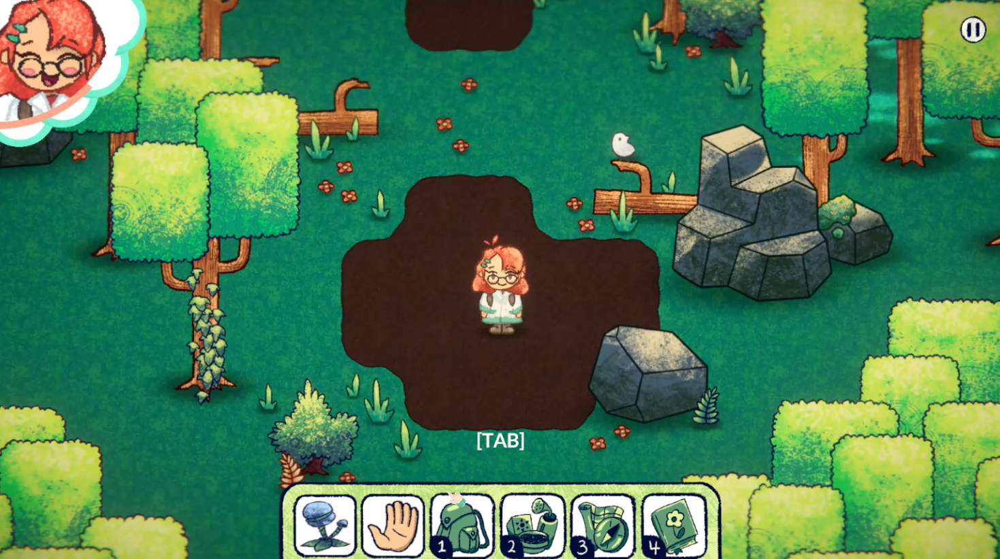
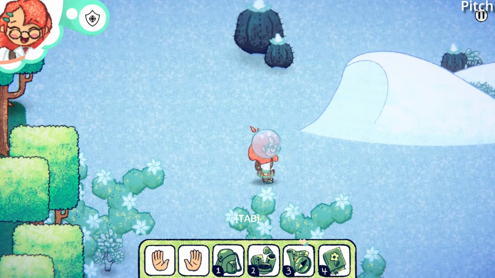
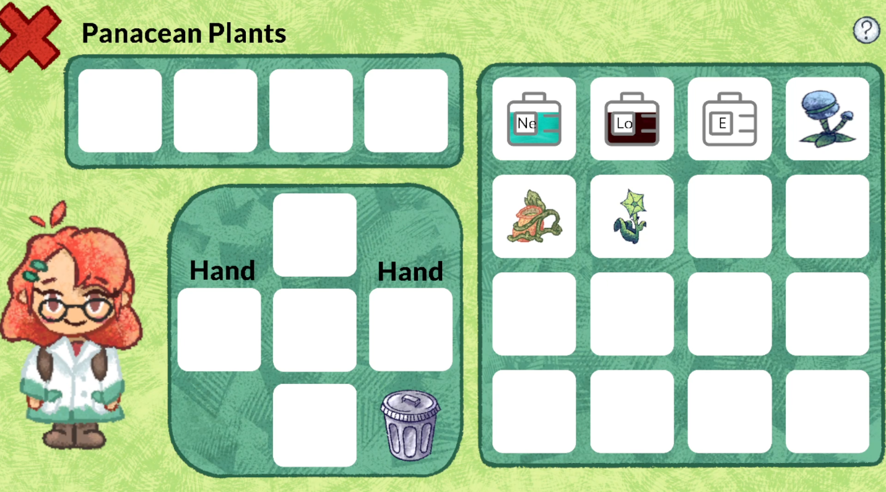
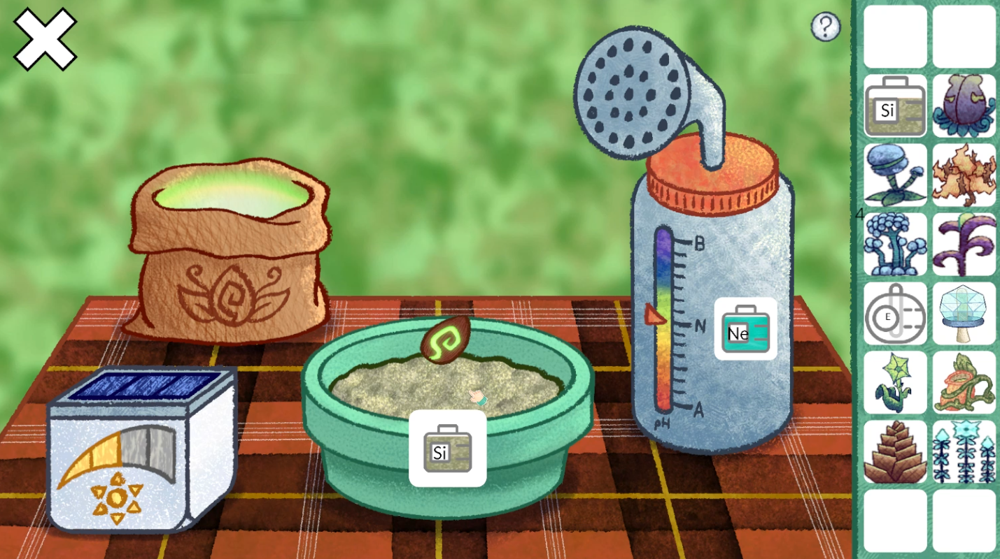

# Botography
Become a Botanist in Botography, a cozy 2D adventure-exploration game. Plants give the player special powers such as destroying obstacles, going underwater, traversing different elevations, and enduring harsh environments. To find these plants, the player must experiment with different soil and water combinations or find recipes in notes scattered in the world.
 
 
The game was
worked by 16 students with 6 Computer Science, 8 Game Design, and 2 Sound Engineer students. I and one other led the development of all features of the game with multiple scrums. I was mainly responsible for coding player movement, elevation traversal, various plant abilities, item stacking system, underwater system, and almanac system. I assisted in the placement system, saving system, settings system, and inventory system. I also worked to improve upon the art of the Game Design students by adding shadows, post-processing, blur effects, and more. The project ultimately won second place out of roughly 60 projects in the senior project showcase.

# How to Run
* Download Unity Version 2022.3.10f1
* Open the project in Unity
* Go to File -> Build Settings -> Build and choose a build location
* Open Botography.exe

# Screenshots

# Built With
* Unity
* C#
* Perforce

# Computer Science Authors
* Richard Vo
* Brandon Pero
* Sully Jenkins
* Quan Ngo
* Samprati Sinha
* Jack Hanes

# Game Design Authors
* Serena Shafer
* E Berlin
* Riley Chiang
* Conor Stewart
* Eric Andreski
* Heath Bailey
* Theresa Merritt
* Ben Naab

# Sound Design Authors
* Sienna Bigelow
* Everest Robinson
